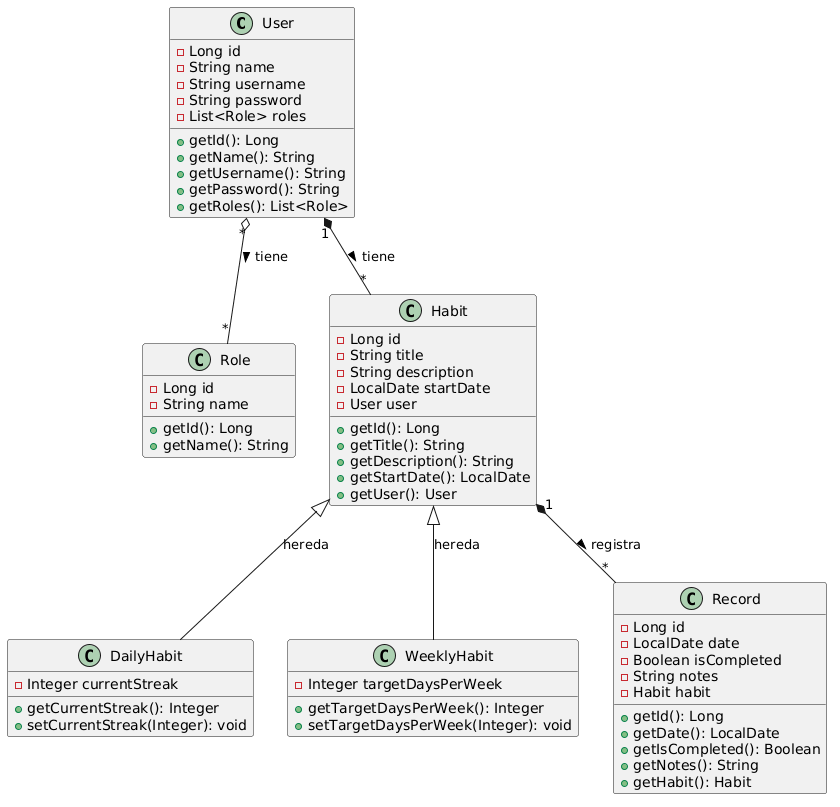

# Habit Tracker API

API REST para gestionar hábitos. Proyecto final de Ironhack.

## Descripción del proyecto

Aplicación backend para crear y seguir hábitos diarios y semanales. Los usuarios pueden registrarse, crear hábitos, marcar si los han completado cada día y obtener análisis con IA.

## Diagrama de clases

La clase `Habit` es la padre y tiene dos hijas: `DailyHabit` y `WeeklyHabit`. Usé la estrategia de herencia `JOINED` porque cada tipo de hábito tiene sus propios campos específicos (como `currentStreak` para los diarios o `targetDaysPerWeek` para los semanales).

## Configuración

1. Clona el repositorio
2. Crea una base de datos MySQL llamada `habit_tracker`
3. En `src/main/resources/application.properties`:
   - Pon tu contraseña de MySQL en `spring.datasource.password`
   - Pon tu API key de OpenAI en `spring.ai.openai.api-key`
4. Ejecuta `HabittrackerApplication.java`

Cuando arranca, se crean automáticamente 2 usuarios de prueba:
- `alex` / `1234`
- `maria` / `1234`

## Tecnologías utilizadas

## Estructura de controladores y rutas

### Authentication
- `POST /api/login` - Login, devuelve token JWT

### Users
- `GET /api/users` - Ver todos los usuarios (admin)
- `POST /api/users` - Crear usuario (admin)

### Habits
- `GET /api/habits` - Ver todos los hábitos
- `GET /api/habits/{id}` - Ver un hábito por ID
- `POST /api/habits` - Crear hábito
- `PUT /api/habits/{id}` - Actualizar hábito
- `DELETE /api/habits/{id}` - Borrar hábito

### Records
- `GET /api/records` - Ver todos los registros
- `GET /api/records/{id}` - Ver un registro por ID
- `POST /api/records/habit/{habitId}` - Crear registro de un hábito
- `PUT /api/records/{id}` - Actualizar registro
- `DELETE /api/records/{id}` - Borrar registro

### AI
- `POST /api/ai/insights` - Análisis de hábitos con IA
- `POST /api/ai/weekly-report` - Reporte semanal con IA

## Enlaces adicionales

- [Trello](TU_LINK_DE_TRELLO)
- [Presentación](TU_LINK_DE_PRESENTACION)

## Trabajo futuro

- Añadir notificaciones push para recordar hábitos
- Implementar gráficos de progreso en el frontend
- Mejorar los prompts de IA para dar consejos más personalizados
- Añadir tests unitarios

## Recursos

- [Documentación de Spring Boot](https://docs.spring.io/spring-boot/docs/current/reference/htmlsingle/)
- [Spring Security Reference](https://docs.spring.io/spring-security/reference/index.html)
- [Spring AI Documentation](https://docs.spring.io/spring-ai/reference/)
- [Baeldung - JWT with Spring Security](https://www.baeldung.com/spring-security-jwt)
- [StackOverflow - JPA Inheritance Strategies](https://stackoverflow.com/questions/3579779/how-to-do-inheritance-with-jpa-and-hibernate)

## Miembros del equipo

- Alejandro Cao - Desarrollo completo del proyecto